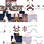

# Dark Dungeon Skins

__Note: These skins were taken offline and are not created by, or the property of anyone working on the Dark Dungeons Data Pack__**

This is a record of skin files, just in case a website loses the skin file, or the link breaks.

## NPCs

| NPC Name | NPC Category | NPC Subcategory | Link | Image |
| -------- | -------- | -------- | -------- | -------- |
| Fishing 1 | Fishing | N/A | [url](https://mineskin.org/skins/b5d42cca93614c699a3f0269f1b140c4) |  |
| Fishing 2 | Fishing | N/A | [url](https://mineskin.org/skins/9204d6aa0e544ae48e8bcb2e0cb1ea0b) |  |
| Farmer 1 | Generic | Farmer | [url](https://mineskin.org/skins/717b1f35fe084f9790044b32b31fd127) |  |
| Homeless 1 | Generic | Homeless | [url](https://mineskin.org/skins/2b89bd3e66b8481592cb2fdc8f4dc394) |  |
| Crew Mate 1 | Generic | Sailor | [url](https://mineskin.org/skins/279124a6fd1145baa63d45363d1c781c) |  |
| Crew Mate 2 | Generic | Sailor | [url](https://mineskin.org/skins/df9bd33917a045a98f02e80f117b5d8f) |  |
| Bank Manager 1 | Important | Bank Manager | [url](https://mineskin.org/skins/b1430503567d4fadb9c3a3a6ecaca73f) |  |
| Guild Master 1 | Important | Guild Master | [url](https://mineskin.org/skins/33f3b4797f6442debb2cc1239036e923) |  |
| Head Guard 1 | Important | Head Civil Servant Guard | [url](https://mineskin.org/skins/0ed559e48f744b45956458167cd7b4ca) |  |
| Innkeeper 1 | Important | Innkeeper | [url](https://mineskin.org/skins/a34e80037c8f4f7aa5f92aeef54a24f7) |  |
| Lookout Guard 1 | Kingdom | Lookout Guard | [url](https://mineskin.org/skins/0b25d461e92749c480d6352879ebd420) |  |
| Ritual Summoner 1 | Kingdom | Ritual Summoner | [url](https://mineskin.org/skins/88a4ee5c4a8b4e01a0755f2b414b0556) |  |
| Apothecary 1 | Merchants | Apothecary | [url](https://mineskin.org/skins/858917c3b27b473f8f246cc2d76a8367) |  |
| Baker 1 | Merchants | Baker | [url](https://mineskin.org/skins/0c1eb26348904d01b3b8f45bdefbc3d5) |  |
| Berry 1 | Merchants | Berry | [url](https://mineskin.org/skins/d6806097657643edbd3b55f35c020cb0) |  |
| Butcher 1 | Merchants | Butcher | [url](https://mineskin.org/skins/1243a31a257e4035873e4ac2fef147be) |  |
| Craftsman 1 | Merchants | Craftsman | [url](https://mineskin.org/skins/38ed4795bbc1476b9f3a5a76e1ebdb5d) |  |
| Craftsman 2 | Merchants | Craftsman | [url](https://mineskin.org/skins/80bba33526124193bcc0602c038e7206) |  |
| Craftsman 3 | Merchants | Craftsman | [url](https://mineskin.org/skins/b490b8a8ad86421394e43805c545f4e1) |  |
| Generic Merchant 1 | Merchants | Generic | [url](https://mineskin.org/skins/1079d03eda424018a7c48e70a07d98dd) |  |
| Generic Merchant 2 | Merchants | Generic | [url](https://mineskin.org/skins/6fb6d84a40e548de81f5feb82b15952f) |  |
| Generic Merchant 3 | Merchants | Generic | [url](https://mineskin.org/skins/e9d7315abda74d9f880975508b160ee8) |  |
| Common Receptionist 1 | Receptionist | N/A | [url](https://mineskin.org/skins/06216e087bfc4e3a948786893f96058e) |  |
| Common Receptionist 2 | Receptionist | N/A | [url](https://mineskin.org/skins/ada4ebaafe6a4e519f2f4cd0d79fa1bf) |  |
| Common Receptionist 3 | Receptionist | N/A | [url](https://mineskin.org/skins/523c2053b5634690ba04a960d7958190) |  |
| Fancy Receptionist 1 | Receptionist | N/A | [url](https://mineskin.org/skins/d17c79abe50943009ed09de4e39af99c) |  |
| Fancy Receptionist 2 | Receptionist | N/A | [url](https://mineskin.org/skins/14acbd9502aa4b3285e7d38443ad10d0) |  |
| Fancy Receptionist 3 | Receptionist | N/A | [url](https://mineskin.org/skins/94b8b4114f814d09a911dcd9de401412) |  |
| Tavern Waiter 1 | Tavern Waiter | N/A | [url](https://mineskin.org/skins/3a4cd923956349d4aa2186d34af41736) |  |
| Tavern Waiter 2 | Tavern Waiter | N/A | [url](https://mineskin.org/skins/df9bd33917a045a98f02e80f117b5d8f) |  |
