# Dark Dungeon Skins

**Note: These skins were taken offline and are not created by, or the property of anyone working on the Dark Dungeons Data Pack**.

This is a record of skin files, just in case a website loses the skin file, or the link breaks.

## NPCs

| NPC Name              | NPC Category  | NPC Subcategory          | Link                                                               | Image                                                    |
| --------------------- | ------------- | ------------------------ | ------------------------------------------------------------------ | -------------------------------------------------------- |
| Fishing 1             | Fishing       | N/A                      | [url](https://mineskin.org/skins/b5d42cca93614c699a3f0269f1b140c4) |                          |
| Fishing 2             | Fishing       | N/A                      | [url](https://mineskin.org/skins/9204d6aa0e544ae48e8bcb2e0cb1ea0b) |                          |
| Boy 1                 | Generic       | Children                | [url](https://mineskin.org/skins/83295b7dcdba4dfb985ddece30d8c4a2) | 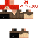                       |
| Boy 2                 | Generic       | Children                | [url](https://mineskin.org/skins/83ec718ab5d14729ab955a852e087fe3) | 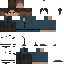                       |
| Boy 3                 | Generic       | Children                | [url](https://mineskin.org/skins/da801cf2ca394ab6b6cc3bd5bb5c7695) | 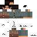                       |
| Girl 1                | Generic       | Children                | [url](https://mineskin.org/skins/5b3655e914f04ee8a7ae80f23af061d9) | 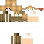                       |
| Girl 2                | Generic       | Children                | [url](https://mineskin.org/skins/786bb6690be0442b8c7aa6d1b3d6ed4d) | 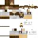                       |
| Commoner 1            | Generic       | Commoner                | [url](https://mineskin.org/skins/64777f355a5e4e84a67e8470e9cfc94c) |                        |
| Commoner 2            | Generic       | Commoner                | [url](https://mineskin.org/skins/0c87694ad1b84ffab732bde11768f1f5) | 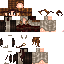                       |
| Commoner 3            | Generic       | Commoner                | [url](https://mineskin.org/skins/36cbc32b9ad3443296214a440f0b8e74) | 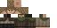                       |
| Commoner 4            | Generic       | Commoner                | [url](https://mineskin.org/skins/ece78b738e174a8dbea9a53e63f069f5) |                        |
| Commoner 5            | Generic       | Commoner                | [url](https://mineskin.org/skins/9441ab5960274c92a8387964e2642cbe) |                        |
| Commoner 6            | Generic       | Commoner                | [url](https://mineskin.org/skins/0dcc58a0839f4a74953306781ae02348) |                        |
| Commoner 7            | Generic       | Commoner                | [url](https://mineskin.org/skins/d39d94c23c8a45c5bfd19a1c594ecebc) | 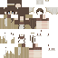                       |
| Commoner 8            | Generic       | Commoner                | [url](https://mineskin.org/skins/affdc369def24596acdae0a3714eafd2) |                        |
| Commoner 9            | Generic       | Commoner                | [url](https://mineskin.org/skins/328b5fc3322d4a35bbb3099bbda82247) | 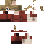                       |
| Commoner 10           | Generic       | Commoner                | [url](https://mineskin.org/skins/eee8a4e89f354e32838dc1d9e85fdc2c) | 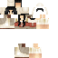                       |
| Commoner 11           | Generic       | Commoner                | [url](https://mineskin.org/skins/d75a258ce87d42f3b8a174162ad23280) |                        |
| Commoner 12           | Generic       | Commoner                | [url](https://mineskin.org/skins/b4f012c8329345d686d0d86bbcb242ea) | 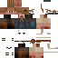                       |
| Commoner 13           | Generic       | Commoner                | [url](https://mineskin.org/skins/e1bbfcd03af54860a0f98ad30c5fb575) | 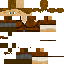                       |
| Commoner 14           | Generic       | Commoner                | [url](https://mineskin.org/skins/07908896838947d89d352cb24abbe6e7) | 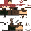                       |
| Commoner 15           | Generic       | Commoner                | [url](https://mineskin.org/skins/463fb268dee84c87bdea4ec82827d460) | 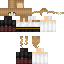                       |
| Commoner 16           | Generic       | Commoner                | [url](https://mineskin.org/skins/772dba5d287f41d8a0f20b5235ae8323) | 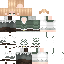                       |
| Commoner 17           | Generic       | Commoner                | [url](https://mineskin.org/skins/2223b89269f14299bacc8f99f618ae03) | 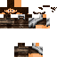                       |
| Commoner 18           | Generic       | Commoner                | [url](https://mineskin.org/skins/50096f5d7f9d49f881e0205cde13e86d) | 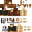                       |
| Farmer 1              | Generic       | Farmer                   | [url](https://mineskin.org/skins/717b1f35fe084f9790044b32b31fd127) |                            |
| Homeless 1            | Generic       | Homeless                 | [url](https://mineskin.org/skins/2b89bd3e66b8481592cb2fdc8f4dc394) | 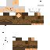                       |
| Mercenary 1           | Generic       | Mercenary                | [url](https://mineskin.org/skins/f6dfcbe071774a7cb3c5bc8f4c4d9be4) |                        |
| Mercenary 2           | Generic       | Mercenary                | [url](https://mineskin.org/skins/8a336e17831f4acebccb49e0c8862bc2) |                        |
| Mercenary 3           | Generic       | Mercenary                | [url](https://mineskin.org/skins/67d03d7a8fc84416812eb4184535cd6b) |                        |
| Mercenary 4           | Generic       | Mercenary                | [url](https://mineskin.org/skins/270be5d48c79452486ca6e03aaf4b914) |                        |
| Mercenary 5           | Generic       | Mercenary                | [url](https://mineskin.org/skins/f60618cb293149b692fd61d21a596a2b) |                        |
| Mercenary 6           | Generic       | Mercenary                | [url](https://mineskin.org/skins/8c1201c0ebd74ca2ac59deb01eeb4b30) |                        |
| Mercenary 7           | Generic       | Mercenary                | [url](https://mineskin.org/skins/e25130810c0b4d7aba3edc35270568e2) |                        |
| Mercenary 8           | Generic       | Mercenary                | [url](https://mineskin.org/skins/a7356297b38a41479732f95dae2c426c) |                        |
| Mercenary 9           | Generic       | Mercenary                | [url](https://mineskin.org/skins/f7b1d864e61045d28d1bb9d4fc804f94) |                        |
| Mercenary 10           | Generic       | Mercenary                | [url](https://mineskin.org/skins/dae89794ae604e87a887f49a1036c456) |                        |
| Mercenary 11           | Generic       | Mercenary                | [url](https://mineskin.org/skins/c89a9c4938714a1a97a9086dadc39765) |                        |
| Mercenary 12           | Generic       | Mercenary                | [url](https://mineskin.org/skins/97c2c83d08f1487791979cb18d0f2cda) |                        |
| Mercenary 13           | Generic       | Mercenary                | [url](http://mineskin.org/skins/1f68894a1e6f4b749a00fff486520df8) |                        |
| Mercenary 14           | Generic       | Mercenary                | [url](https://mineskin.org/skins/56570b78190c489f917f170110194f8e) |                        |
| Mercenary 15           | Generic       | Mercenary                | [url](https://mineskin.org/skins/1cd093b6179a4c248debaca43b18262a) |                        |
| Mercenary 16           | Generic       | Mercenary                | [url](https://mineskin.org/skins/2e9537e45d03415ab8c3e8c9d5865496) |                        |
| Mercenary 17           | Generic       | Mercenary                | [url](https://mineskin.org/skins/a7eea9a43cce47439275d7ad8aad814a) |                        |
| Mercenary 18           | Generic       | Mercenary                | [url](https://mineskin.org/skins/ce2c0b5c6dd945c994de5f85bda9fe0d) |                        |
| Mercenary 19           | Generic       | Mercenary                | [url](https://mineskin.org/skins/fe6bf3d257874eb3b8a3a9f32102ebf5) |                        |
| Mercenary 20           | Generic       | Mercenary                | [url](https://mineskin.org/skins/02d281f819ff4635a2176e37c8aa3a9c) |                        |
| Mercenary 21           | Generic       | Mercenary                | [url](https://mineskin.org/skins/44e77717231a49ee8259f92619481e27) |                        |
| Mercenary 22           | Generic       | Mercenary                | [url](https://mineskin.org/skins/dc458a0f900d4e70a8b29f6d0f062be9) |                        |
| Mercenary 23           | Generic       | Mercenary                | [url](https://mineskin.org/skins/8678766683774b78add45566d77d5133) |                        |
| Mercenary 24           | Generic       | Mercenary                | [url](https://mineskin.org/skins/8462b1f2f70843bc8e83de65bcd7dd63) |                        |
| Ruffian 1              | Generic       | Ruffian                  | [url](https://mineskin.org/skins/5ca338cdab09406698a0eb561e9c372f) | 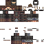                       |
| Ruffian 2              | Generic       | Ruffian                  | [url](https://mineskin.org/skins/f58d30d368d64eaeb18119e070208965) | 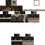                       |
| Ruffian 3              | Generic       | Ruffian                  | [url](https://mineskin.org/skins/4a62825084704ec599311215d2f96ef6) | 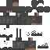                       |
| Ruffian 4              | Generic       | Ruffian                  | [url](https://mineskin.org/skins/7329860b560c4339ae541ddd02795e4d) |                        |
| Crew Mate 1           | Generic       | Sailor                   | [url](https://mineskin.org/skins/279124a6fd1145baa63d45363d1c781c) |                            |
| Crew Mate 2           | Generic       | Sailor                   | [url](https://mineskin.org/skins/df9bd33917a045a98f02e80f117b5d8f) |                            |
| Bank Manager 1        | Important     | Bank Manager             | [url](https://mineskin.org/skins/b1430503567d4fadb9c3a3a6ecaca73f) |                |
| Guild Master 1        | Important     | Guild Master             | [url](https://mineskin.org/skins/33f3b4797f6442debb2cc1239036e923) |                |
| Head Guard 1          | Important     | Head Civil Servant Guard | [url](https://mineskin.org/skins/0ed559e48f744b45956458167cd7b4ca) |      |
| Innkeeper 1           | Important     | Innkeeper                | [url](https://mineskin.org/skins/a34e80037c8f4f7aa5f92aeef54a24f7) |                      |
| Guard 1               | Kingdom       | Guard                    | [url](https://mineskin.org/skins/0b25d461e92749c480d6352879ebd420) |                |
| Guard 2               | Kingdom       | Guard                    | [url](https://mineskin.org/skins/116189f627ce4a9bb96d6bbc1ceaf424) |                |
| Guard 3               | Kingdom       | Guard                    | [url](https://mineskin.org/skins/72260220f57e418f9b1968b621fb2768) |                |
| Guard 4               | Kingdom       | Guard                    | [url](https://mineskin.org/skins/9e982ffb3d2f4d4f82d838d5cd34a874) |                |
| Guard 5               | Kingdom       | Guard                    | [url](https://mineskin.org/skins/dec438567b4f4feb89f20ff312e53836) |                |
| Guard 6               | Kingdom       | Guard                    | [url](https://mineskin.org/skins/32601db6e448413283233692f0cf0f37) |                |
| Guard 7               | Kingdom       | Guard                    | [url](https://mineskin.org/skins/2a2ec5e7763146b5be943e8ae791c988) |                |
| Guard 8               | Kingdom       | Guard                    | [url](https://mineskin.org/skins/f8999b95ad264843923b1d703e1d542a) |                |
| Ritual Summoner 1     | Kingdom       | Ritual Summoner          | [url](https://mineskin.org/skins/88a4ee5c4a8b4e01a0755f2b414b0556) |          |
| Apothecary 1          | Merchants     | Apothecary               | [url](https://mineskin.org/skins/858917c3b27b473f8f246cc2d76a8367) |                    |
| Baker 1               | Merchants     | Baker                    | [url](https://mineskin.org/skins/0c1eb26348904d01b3b8f45bdefbc3d5) |                              |
| Berry 1               | Merchants     | Berry                    | [url](https://mineskin.org/skins/d6806097657643edbd3b55f35c020cb0) |                              |
| Butcher 1             | Merchants     | Butcher                  | [url](https://mineskin.org/skins/1243a31a257e4035873e4ac2fef147be) |                          |
| Craftsman 1           | Merchants     | Craftsman                | [url](https://mineskin.org/skins/38ed4795bbc1476b9f3a5a76e1ebdb5d) |                      |
| Craftsman 2           | Merchants     | Craftsman                | [url](https://mineskin.org/skins/80bba33526124193bcc0602c038e7206) |                      |
| Craftsman 3           | Merchants     | Craftsman                | [url](https://mineskin.org/skins/b490b8a8ad86421394e43805c545f4e1) |                      |
| Generic Merchant 1    | Merchants     | Generic                  | [url](https://mineskin.org/skins/1079d03eda424018a7c48e70a07d98dd) |        |
| Generic Merchant 2    | Merchants     | Generic                  | [url](https://mineskin.org/skins/6fb6d84a40e548de81f5feb82b15952f) |        |
| Generic Merchant 3    | Merchants     | Generic                  | [url](https://mineskin.org/skins/e9d7315abda74d9f880975508b160ee8) |        |
| Common Receptionist 1 | Receptionist  | N/A                      | [url](https://mineskin.org/skins/06216e087bfc4e3a948786893f96058e) |  |
| Common Receptionist 2 | Receptionist  | N/A                      | [url](https://mineskin.org/skins/ada4ebaafe6a4e519f2f4cd0d79fa1bf) |  |
| Common Receptionist 3 | Receptionist  | N/A                      | [url](https://mineskin.org/skins/523c2053b5634690ba04a960d7958190) |  |
| Fancy Receptionist 1  | Receptionist  | N/A                      | [url](https://mineskin.org/skins/d17c79abe50943009ed09de4e39af99c) |    |
| Fancy Receptionist 2  | Receptionist  | N/A                      | [url](https://mineskin.org/skins/14acbd9502aa4b3285e7d38443ad10d0) |    |
| Fancy Receptionist 3  | Receptionist  | N/A                      | [url](https://mineskin.org/skins/94b8b4114f814d09a911dcd9de401412) |    |
| Tavern Waiter 1       | Tavern Waiter | N/A                      | [url](https://mineskin.org/skins/3a4cd923956349d4aa2186d34af41736) |              |
| Tavern Waiter 2       | Tavern Waiter | N/A                      | [url](https://mineskin.org/skins/df9bd33917a045a98f02e80f117b5d8f) |              |
